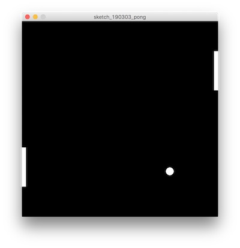
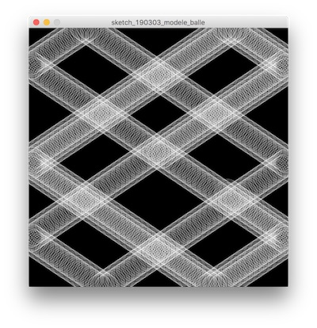
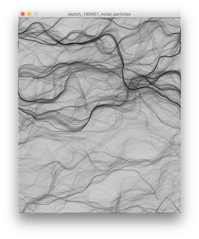

LAG4U6 // 2018-2019
====================================

### Téléchargement des sketches
Vous trouverez ici tous les sketchs qui ont été étudiés en cours :point_right: https://github.com/v3ga/Cours_Bordeaux_Montaigne/raw/master/L2_2018_2019/L2_2018_2019.zip

### Références pour ce cours

**[Manuel Processing](https://fr.flossmanuals.net/processing/introduction/)** 

**[Designing Programs par Mark Webster](https://designingprograms.bitbucket.io/)** 
« Designing Programs is a practical and pedagogical approach to programming, tailored for visual arts students. »

**[Programming design systems par Rune Madsen](https://www.programmingdesignsystems.com/)**  
« A free digital book that teaches a practical introduction to the new foundations of graphic design. By Rune Madsen. »

### Barême pour les exercices / projets
Pour les exercices que je vous donne, le barême est le suivant (sur 10)
* **rendu en temps et en heure** :point_right: 1 point.
* **respect de la consigne** :point_right: 3 points. 
Le sketch doit être au bon format : 
   * envoi du **dossier** de sketch avec le fichier .pde à l'intérieur + éventuellement les média associés.
   * le nom du fichier .pde doit être le même que le nom du dossier
   * les noms de sketches seront sous la forme **sketch_date_rendu_nom_prenom**. Exemple : exercice à rendre pour le 18 février :point_right: sketch_190218_dupond_marie
   * envoi par e-mail, pas de wetransfer (merci).
* **créativité** :point_right: 6 points. 
J'entends par créativité une recherche graphique personelle et/ou interactive qui peut se faire à partir de sketches vus en classe.

## Cours #01 — Introduction — 21 janvier
* Présentation du travail de [2Roqs](http:www.2roqs.com) et du travail de designer d'interactions.
* Une brève histoire des ordinateurs et des relations entre algorithmes et création visuelle.
* Présentation de l'environnement [Processing](http://www.processing.org) et de son « écosystème ». 

### Références
* [History of computer art — part 1](http://piratefsh.github.io/2019/01/07/computer-art-history-part-1.html)
* [A Modern Prometheus — The history of Processing by C.Reas & B.Fry](https://medium.com/processing-foundation/a-modern-prometheus-59aed94abe85)
* [Welcome to Processing](https://vimeo.com/140600280), vidéo en anglais par [Dan Shiffman](http://shiffman.net/) pour [la fondation Processing](https://processingfoundation.org/).
* [Téléchargement de Processing 3](https://www.processing.org/download/)
* [Processing Foundation](https://processingfoundation.org/)
 
## Cours #02 — 28 janvier
*À rattraper*

## Cours #03 — Dessiner — 04 février
* repère de dessin, dimension de la fenêtre avec [size](https://processing.org/reference/size_.html)
* mode basique
* dessin de formes géométriques : [point](https://processing.org/reference/point_.html), [line](https://processing.org/reference/line_.html), [ellipse](https://processing.org/reference/ellipse_.html), [rect](https://processing.org/reference/rect_.html).
* dessin de formes géométriques « composées » : [beginShape](https://processing.org/reference/beginShape_.html) / [vertex](https://processing.org/reference/vertex_.html) / [endShape](https://processing.org/reference/endShape_.html)
* gestion des couleurs ([color](https://processing.org/reference/color_.html)) et des options de dessin([stroke](https://processing.org/reference/stroke_.html), [noStroke](https://processing.org/reference/noStroke_.html), [fill](https://processing.org/reference/fill_.html), [noFill](https://processing.org/reference/noFill_.html), [strokeWeight](https://processing.org/reference/strokeWeight_.html))
* exporter / faire une capture d'écran avec la fonction [saveFrame](https://processing.org/reference/saveFrame_.html)

### Références
* Manuel Floss [FR] - [l'espace de dessing dans Processing](http://fr.flossmanuals.net/processing/lespace-de-dessin/) + [les couleurs](http://fr.flossmanuals.net/processing/les-couleurs/) + [les formes](http://fr.flossmanuals.net/processing/les-formes/)
* [Color models and color spaces / Rune Madsen](https://www.programmingdesignsystems.com/color/color-models-and-color-spaces/index.html#color-models-and-color-spaces-JDQ1fRD)

## Cours #04 — Animer — 11 février
* mode continu :
  * gestionnaires [setup()](https://processing.org/reference/setup_.html) et [draw()](https://processing.org/reference/draw_.html)
* animer avec le générateur de nombre aléatoire [random](https://processing.org/reference/random_.html)
* variables prédéfinies pour capter la position de la souris : [mouseX](https://processing.org/reference/mouseX.html) et [mouseY](https://processing.org/reference/mouseY.html).
* gestionnaire d'évènements [keyPressed](https://processing.org/reference/keyPressed_.html) pour capter lorsque l'utilisateur appuit sur une touche du clavier.

### Références
* Dan Shiffman [EN] - [Using random()](https://www.youtube.com/watch?v=50Rzvxvi8D0)
* Manuel Floss [FR] - [Dessiner / les évènements souris](https://fr.flossmanuals.net/processing/les-evenements-souris/)

#### Exercice à rendre pour le lundi 18 février
Choisir deux lettres de l'alphabet et les dessiner avec les contraintes suivantes : 
* utiliser des formes géométriques. 
* couleurs noir et blanc.
* fenêtre hométhétique avec le format A4 ( par exemple size (420,600) )
* avoir un gestionnaire de clavier qui exporte la lettre dans un fichier "A.png" pour la lettre A, "B.png" pour B , etc ...

Je compte sur vous pour vous coordonner pour que l'on puisse constituer un abécédaire complet de A à Z sur les 2 classes de TD. Les créations seront présentées en ligne sur une page dédiée aux projets de cet UE. 

À me remettre par e-mail pour **lundi 18 février avant midi** :  
* 2 sketches processing, un pour chaque lettre contenant le code + export image pour chaque.
* Le nom du sketch doit être **sketch_190218_nom_prenom**

### Références à voir (dans le désordre)
* [Le Bifur de Cassandre](http://signes.org/set.php?id=47&retour=1929)
* [Prototypo](https://www.prototypo.io/)
* [Lettres de Laurent Malys](https://www.itsnicethat.com/articles/laurent-malys-digital-graphic-design-070219)

## Cours #05 — Mémoriser — 18 février
* Exporter au format SVG ([Scalable Vector Graphics](https://fr.wikipedia.org/wiki/Scalable_Vector_Graphics)), utilisation conjointe des fonctions [beginRecord](https://processing.org/reference/beginRecord_.html) et [endRecord](https://processing.org/reference/endRecord_.html) avec importation de la librairie SVG de Processing.
* Notions de variables : 
  * Type de données [PImage](https://processing.org/reference/PImage.html), chargement et affichage d'une image.
  * Utiliser les informations de couleur contenues dans une image via la fonction [PImage.get(x,y)]((https://processing.org/reference/get_.html)) pour générer une composition « pointilliste ».
  

### Références
* Manuel Floss [FR] - [Les variables](http://fr.flossmanuals.net/processing/les-variables/)
* Manuel Floss [FR] - [Les images](http://fr.flossmanuals.net/processing/les-images/)
* Manuel Floss [FR] - [La typographie](http://fr.flossmanuals.net/processing/la-typographie/)
* Dan Shiffman [EN] - [Variables](https://www.youtube.com/watch?v=B-ycSR3ntik)
* Dan Shiffman [EN] - [Intro to images](https://www.youtube.com/watch?v=-f0WEitGmiw)
* Site Processing [EN] - [Pointillism](https://processing.org/examples/pointillism.html)

#### Exercice à rendre pour le dimanche 3 mars (avant 19h)
Réaliser un collage d'images (au moins trois) qui représente un visage. Pour cela, vous utiliserez autant de variables de type [PImage](https://processing.org/reference/PImage.html) que nécessaire. Les dimensions de la fenêtre seront carrées ( 600 x 600). Au moins une des images devra être réactive à la souris, le mode continu est nécessaire pour gérer cette animation.

Quelques exemples à regarder : 
 * [Les collages de John Stezaker](http://www.laboiteverte.fr/les-collages-de-john-stezaker/)
 * [Les collages de Louise Bedart](http://lbdanse.org/collages/)

## Cours #06 — 04 mars
* Branchement / condition avec if 
* Modélisation d'une bille rebondissante sur les bordures de la fenêtre : position, vitesse et conditions aux limites.
* Programmation du jeu Pong avec le modèle de balle et de raquettes.

### Références
* Manuel Floss [FR] - [Les conditions](https://fr.flossmanuals.net/processing/les-conditions/)
* [Coding Challenge #67: Pong!](https://www.youtube.com/watch?v=IIrC5Qcb2G4)

## Cours #07 — Répéter — 11 mars
* [Boucle for](https://fr.flossmanuals.net/processing/les-repetitions/) pour répéter une série d'instructions.
* Utilisation d'une double boucle imbriquée pour paver l'espace.

### Références
* Manuel Floss [FR] - [Les répétitions](https://fr.flossmanuals.net/processing/les-repetitions/)
* Casey Reas [EN] — [10 PRINT CHR$(205.5+RND(1))](http://reas.com/10_print/)
* [Vera Molnar](http://www.veramolnar.com/)
* [Frider Nake](http://dada.compart-bremen.de/item/agent/68) 
* [Recode project](http://recodeproject.com/)

## Cours #08 — Bis repetita — 18 mars
*Message du 11/03 — nous reverrons les aspects de ce principe de répétition la semaine prochaine (le 18/03) pendant la première heure de cours et je vous laisserai ensuite travailler une heure en autonomie sur cet exercice qui sera à rendre du coup pour la semaine suivante (le 25/03). Je pourrai vous accompagner sur cette création.
Je vous demande donc pour la semaine prochaine de revoir ce que nous avons fait et notamment de consulter les ressources en ligne (manuel Floss). Vous pouvez aussi consulter la consigne que j’avais donnée à vos prédécesseurs l’année dernière.* 

## Cours #09 — Collectionner — 25 mars
* [Les tableaux](https://processing.org/reference/arrayaccess.html)
* Création de tableaux pour la gestion d'un ensemble de particules contraintes par les bords de la fenêtre de dessin.
* Algorithme pour dessiner les liens entre particules.

## Cours #10 — Paramétrer - 1er avril
* Interface graphique via la librairie [ControlP5](http://www.sojamo.de/libraries/controlP5/) : slider, toggle, button.
* Exemple simple avec le paramètrage des propriétés d'une ellipse (position, taille). 
* Fonction [noise](https://processing.org/reference/noise_.html) 1D, 2D, 3D dans Processing : application à la vitesse d'un ensemble de particules.

#### À faire pour le lundi 8 avril prochain
Pour ces deux derniers cours de l'année l'objectif sera de produire des graphismes générés qui seront imprimés sur le plotter [Axidraw](https://www.axidraw.com/) que j'amènerai pour la dernière séance le 15 avril. Comme l'impression prend un certain temps (fonction de la complexité du motif produit auquel il faut rajouter le temps de préparation du plotter), je vous demanderai **de former des groupes de 2 personnes** ( soit 15 groupes en tout ) pour travailler lors de ces deux derniers cours, et de réflechir à ce que vous voulez imprimer. Nous consacrerons le cours #11 à la production du fichier à imprimer.

Les contraintes seront : 
* Processing / une seule couleur possible pour le motif, avec contour et pas de remplissage. Il sera bien entendu possible de reprendre vos travaux / exercices des cours précédents. 
* Axidraw / format final A4 au format SVG, il sera possible d'imprimer deux motifs sur une feuille avec une mise en page adéquate qui sera faite sur Inkscape.
* Axidraw / impression sur papier noir avec feutre blanc (0.5 mm) ou sur papier blanc avec feutre noir (0.01 à 0.5 mm pour les pointes) 

## Cours #11 — 8 avril

## Cours #12 — 15 avril

