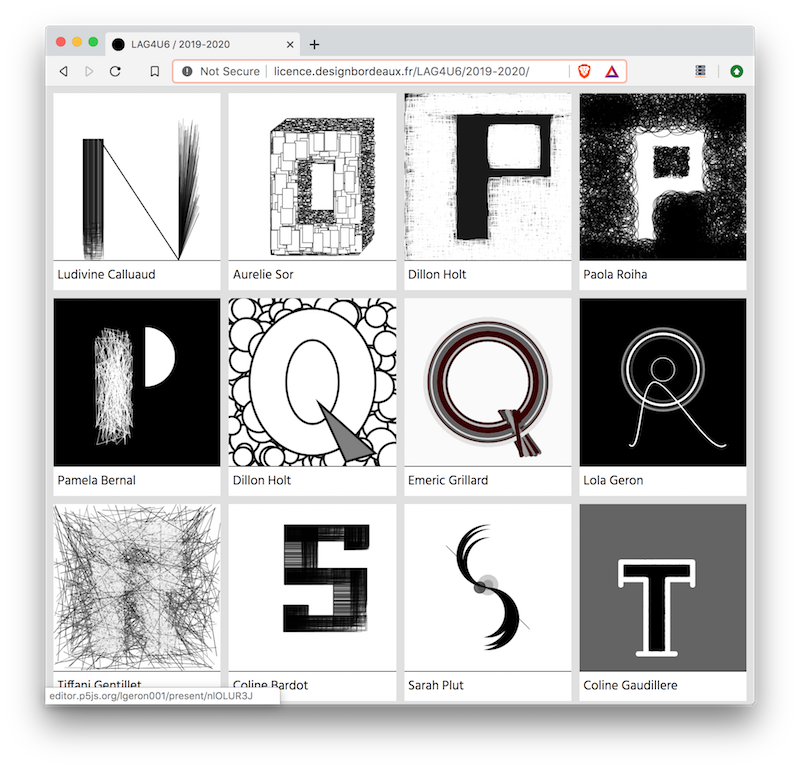
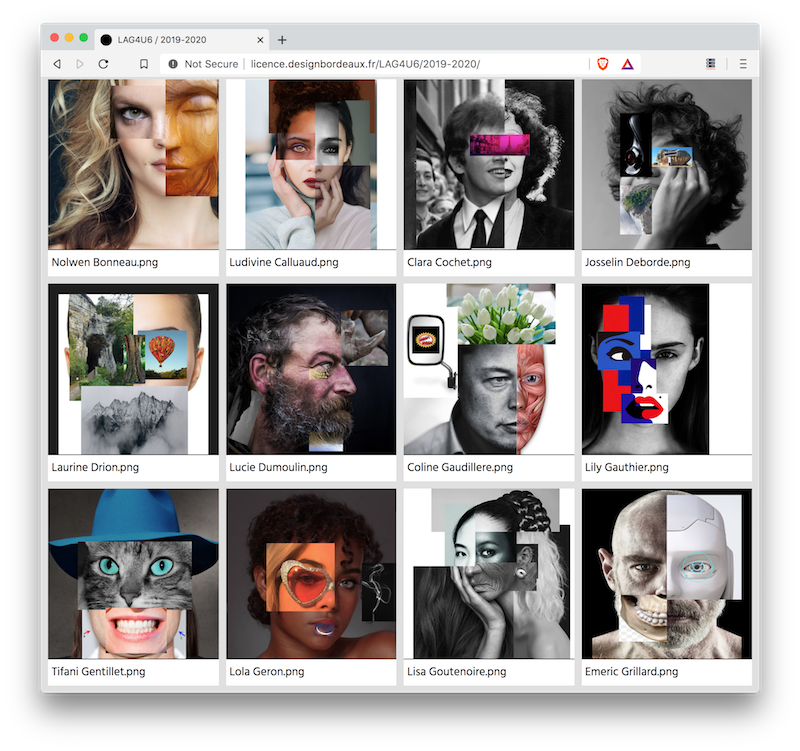
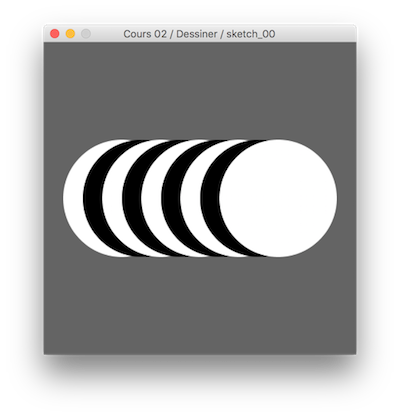
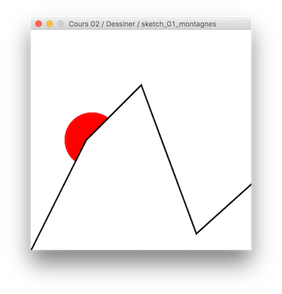
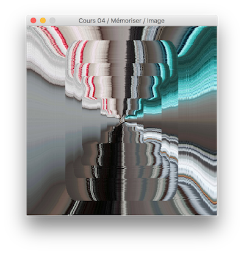
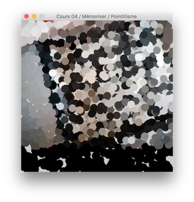
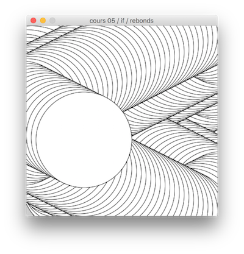
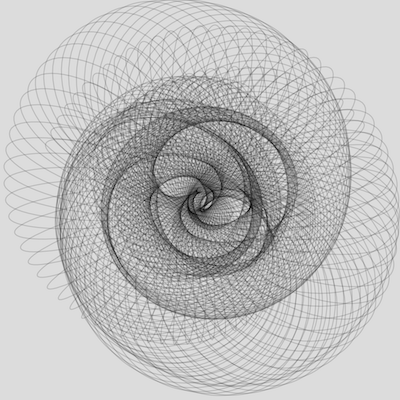
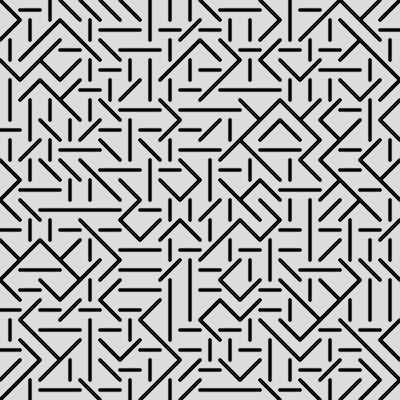

LAG4U6 // 2019-2020
====================================

### Continuité pédagogique
Les prochains cours se feront en ligne et si possible en classe entière. Voici le planning des prochains cours : 
 * vendredi 27 mars de 10h30 à 12h30.
 * lundi 30 mars de 10h30 à 12h30.
 * lundi 6 avril de 10h30 à 12h30.
 * lundi 13 avril de 10h30 à 12h30 en rattrapage du cours manqué du lundi 16 mars.
 * mecredi 15 avril de 10h30 à 12h30.

Pour assurer ces cours en ligne, j'ai opté pour :  
  * [Google Meet](https://meet.google.com/). Les sessions seront enregistrées et placées en ligne pour ceux qui ne pourraient pas suivre ces cours.
  * [Slack](https://slack.com/intl/fr-fr/) pour assurer un chat / questions en direct. 
  
Je vous demanderais pour suivre le cours en ligne de suivre avec un casque / micro si possible pour limiter le bruit ambiant. Vous pouvez enfin tester votre connexion avec le site suivant : https://www.speedtest.net/ Pour suivre, un débit au minimum de 10-15 Mbps semble correct. 
 

### Barême pour les exercices / projets
Pour les exercices que je vous donne, le barême est le suivant (sur 10)
* **rendu en temps et en heure** :point_right: 1 point.
* **respect de la consigne** :point_right: 3 points. 
Le sketch doit être au bon format : 
   * envoi de l'adresse du sketch en ligne sur [editor.p5.js](https://editor.p5js.org/)
   * les noms de sketches seront sous la forme **sketch_date_rendu_nom_prenom**. Exemple : exercice à rendre pour le 18 février :point_right: sketch_190218_dupond_marie
   * envoi par e-mail, **pas de wetransfer (merci)**.
* **créativité** :point_right: 6 points. 
J'entends par créativité une recherche graphique personelle et/ou interactive qui peut se faire à partir de sketches vus en classe ou de références que vous trouvez en ligne.

#### Exercice 10 février : Lettres programmées
http://licence.designbordeaux.fr/LAG4U6/2019-2020/

#### Exercice 1er mars : Visages
http://licence.designbordeaux.fr/LAG4U6/2019-2020/

## Cours #01 — Introduction — 20 janvier
* Présentation du travail de [2Roqs](http:www.2roqs.com) et du travail de designer d'interactions / créateurs numériques.
* Présentation de l'environnement [Processing](http://www.processing.org) et de son « écosystème » (notamment [p5.js](https://p5js.org/))
* Présentation de l'environnement de développement et premières commandes de dessin.

### Références
* [A Modern Prometheus — The history of Processing by C.Reas & B.Fry](https://medium.com/processing-foundation/a-modern-prometheus-59aed94abe85)
* [Welcome to Processing](https://vimeo.com/140600280), vidéo en anglais par [Dan Shiffman](http://shiffman.net/) pour [la fondation Processing](https://processingfoundation.org/).
* [Téléchargement de Processing 3](https://www.processing.org/download/)
* [Processing Foundation](https://processingfoundation.org/)
* [Design by Numbers](https://dbn.media.mit.edu/) de [John Maeda](https://maedastudio.com/)
* [Ben Fry](https://www.benfry.com/) and [Casey Reas](http://reas.com/)

 ### Ressources
**[Manuel Processing](https://fr.flossmanuals.net/processing/introduction/)** 

**[Designing Programs par Mark Webster](https://designingprograms.bitbucket.io/)** 
« Designing Programs is a practical and pedagogical approach to programming, tailored for visual arts students. »

**[Programming design systems par Rune Madsen](https://www.programmingdesignsystems.com/)**  
« A free digital book that teaches a practical introduction to the new foundations of graphic design. By Rune Madsen. »

## Cours #02 — Dessiner — 27 janvier
* repère de dessin, dimension de la fenêtre / expace de dessin  avec [Processing / size](https://processing.org/reference/size_.html) et [p5js / createCanvas](https://p5js.org/reference/#/p5/createCanvas)
* dessin de formes géométriques : [point](https://processing.org/reference/point_.html), [line](https://processing.org/reference/line_.html), [ellipse](https://processing.org/reference/ellipse_.html), [rect](https://processing.org/reference/rect_.html).
* dessin de formes géométriques « composées » : [beginShape](https://processing.org/reference/beginShape_.html) / [vertex](https://processing.org/reference/vertex_.html) / [endShape](https://processing.org/reference/endShape_.html)
* gestion des couleurs ([color](https://processing.org/reference/color_.html)) et des options de dessin([stroke](https://processing.org/reference/stroke_.html), [noStroke](https://processing.org/reference/noStroke_.html), [fill](https://processing.org/reference/fill_.html), [noFill](https://processing.org/reference/noFill_.html), [strokeWeight](https://processing.org/reference/strokeWeight_.html))
* exporter / faire une capture d'écran avec la fonction [Processing / saveFrame](https://processing.org/reference/saveFrame_.html) et [p5js / save](https://p5js.org/reference/#/p5/save)

### Références
* Manuel Floss [FR] - [l'espace de dessing dans Processing](http://fr.flossmanuals.net/processing/lespace-de-dessin/) + [les couleurs](http://fr.flossmanuals.net/processing/les-couleurs/) + [les formes](http://fr.flossmanuals.net/processing/les-formes/)
* [Color models and color spaces / Rune Madsen](https://www.programmingdesignsystems.com/color/color-models-and-color-spaces/index.html#color-models-and-color-spaces-JDQ1fRD)

## Cours #03 — Animer — 3 février
* Animer : 
  * avec une fonction génératrice de nombre aléatoires : [random](https://processing.org/reference/randomGaussian_.html)  
  * avec la variable de temps [frameCount](https://processing.org/reference/frameCount_.html) et la fonction [millis()](https://processing.org/reference/millis_.html)
  * avec les variables [mouseX](https://processing.org/reference/mouseX.html) et [mouseY](https://processing.org/reference/mouseY.html) pour capter la position de la souris dans la fenêtre.  

### Sketches en ligne 
* [Animation avec mouseX & mouseY](https://editor.p5js.org/v3ga/sketches/3wHO_Yl1)
* [Animation avec random](https://editor.p5js.org/v3ga/sketches/xjVFR3bg)
* [Animation avec frameCount](https://editor.p5js.org/v3ga/sketches/ytLIjyW_)

### Références
* Dan Shiffman [EN] - [Using random()](https://www.youtube.com/watch?v=50Rzvxvi8D0)
* Manuel Floss [FR] - [Dessiner / les évènements souris](https://fr.flossmanuals.net/processing/les-evenements-souris/)

#### Exercice à rendre pour le lundi 10 février
Choisir deux lettres de l'alphabet et les dessiner avec les contraintes suivantes : 
* utiliser des formes géométriques. 
* couleurs noir et blanc.
* taille de fenêtre en (400,400).
* avoir un gestionnaire de clavier qui exporte la lettre dans un fichier "A.png" pour la lettre A, "B.png" pour B , etc ...

Je compte sur vous pour vous coordonner pour que l'on puisse constituer un abécédaire complet de A à Z sur les 2 classes de TD. Les créations seront présentées en ligne sur une page dédiée aux projets de cet UE. 

À me remettre par e-mail pour **lundi 10 février avant midi** :  
* 2 sketches p5.js, un pour chaque lettre contenant le code + export image pour chaque.
* Le nom du sketch doit être **sketch_200210_nom_prenom_[lettre]** , par exemple sketch_200210_dupont_marie_Z

### Références pour l'exercice
* [Parametric](https://parametrictype.bitbucket.io/index.html) par Mark Webster à l'[ESAC](http://www.esac-cambrai.net/)
* [Lettrines](https://area03.bitbucket.io/alpha) par Mark Webster avec les étudiants de l'[ESAD Amiens](http://www.esad-amiens.fr/).
* [Alphagraph](https://bitbucket.org/mwebster_/alphagraph), un outil développé avec Processing pour explorer typographies et formes graphiques.
* [Generative typografie](http://generative-typografie.de/)
* [Lettres de Laurent Malys](https://www.itsnicethat.com/articles/laurent-malys-digital-graphic-design-070219)
* [Le Bifur de Cassandre](http://signes.org/set.php?id=47&retour=1929)

## Cours #04 — Mémoriser — 10 février
Introductions à la notion de variables :
* Chargement et affichage d'une [image](https://p5js.org/reference/#group-Image).
* Utiliser la fonction [imageMode()](https://p5js.org/reference/#/p5/imageMode) pour changer l'origine du dessin de l'image
* Utiliser les informations de couleur contenues dans une image via la fonction [get()](https://p5js.org/reference/#/p5/get) pour générer une composition « pointilliste »

### Sketches en ligne
* [Charger une image et l'afficher](https://editor.p5js.org/v3ga/sketches/2tXKQhjK)
* [Pointillisme avec la souris](https://editor.p5js.org/v3ga/sketches/gpxTYj9G)
* [Pointillisme « random »](https://editor.p5js.org/v3ga/sketches/QW7VJRfS)

### Références en ligne
* [p5.js / Charger des images](http://www.lyceelecorbusier.eu/p5js/?p=2060)

## Cours #05 — Modéliser — 17 février
* Branchement / condition avec if 
* Modélisation d'une bille rebondissante sur les bordures de la fenêtre : position, vitesse et conditions aux limites.
* Programmation du jeu [Pong](https://www.youtube.com/watch?v=it0sf4CMDeM) avec le modèle de balle et de raquettes.

### Sketches en ligne
* [Bille téléportation](https://editor.p5js.org/v3ga/sketches/wyu2_TwG)
* [Bille avec rebonds](https://editor.p5js.org/v3ga/sketches/gpxTYj9G)
* [Pong « solitaire »](https://editor.p5js.org/v3ga/sketches/L8Gv5DJ0)

#### Exercice à rendre pour le dimanche 1er mars
Réaliser un collage d'images (au moins trois) qui représente un visage. Pour cela, vous utiliserez autant de variables représentant une image que nécessaire : 
* Les dimensions de la fenêtre seront carrées (800 x 800)
* Vous implémenterez l'export d'une image à l'appui d'une touche sur le clavier, le nom de l'image devra être **Prénom_Nom.png**

Merci de m'envoyer l'adresse de votre sketche en ligne et l'image par e-mail, de sorte que je puisse facilement mettre vos créations en ligne ensuite.

Quelques exemples à regarder : 
 * [Les collages de John Stezaker](http://www.laboiteverte.fr/les-collages-de-john-stezaker/)
 * [Les collages de Louise Bedart](http://lbdanse.org/collages/)
 
## Cours #06 — 2 mars
Ce cours a été reporté au mercredi 15 avril, de 8h30 à 12h30.

## Cours #07 — Répéter — 9 mars
* Révision de [la structure de controle if](https://fr.flossmanuals.net/processing/les-conditions/)
* [Boucle for](https://fr.flossmanuals.net/processing/les-repetitions/) pour répéter une série d'instructions.
* Utilisation d'une double boucle imbriquée pour paver l'espace avec un motif.

### Sketches en ligne
* [Boucle simple](https://editor.p5js.org/v3ga/sketches/apbjHUqJ)
* [Boucles imbriquées](https://editor.p5js.org/v3ga/sketches/GZZaS50e)

### Références
* Manuel Floss [FR] - [Les répétitions](https://fr.flossmanuals.net/processing/les-repetitions/)
* Casey Reas [EN] — [10 PRINT CHR$(205.5+RND(1))](https://p5js.org/reference/#/p5/translate)

## Cours #08 — Transformer — 27 mars
* Révision de la boucle for et de la double boucle imbriquée : 
  * étude de l'oeuvre ["Quatre éléments distribués au hasard" de Vera Molnar](https://www.centrepompidou.fr/cpv/resource/cez6op/rzEeXa)
* Transformation via les fonctions [translate](https://p5js.org/reference/#/p5/translate), [rotate](https://p5js.org/reference/#/p5/rotate), [scale](https://p5js.org/reference/#/p5/scale) : 
  * application à la création (simple) d'un spirographe.

### Cours en ligne
* [Partie 1](https://www.youtube.com/watch?v=y2Lp94sgfyU)
* [Partie 2](https://www.youtube.com/watch?v=JzgGY900fhA)

### Sketches en ligne
* [Quatre éléments](https://editor.p5js.org/v3ga/sketches/9fhiRVq_D)
* [Spirographe](https://editor.p5js.org/v3ga/sketches/ziw896XJr)

### Références
* [Video / Coding Train : Nested loops](https://www.youtube.com/watch?v=1c1_TMdf8b8)
* [Insta / eikun_0903](https://www.instagram.com/eikun_0903/)
* [Designing Programs : Loops](https://designingprograms.bitbucket.io/pages/07_loops.html)
* [Vera Molnar : Randomness](https://vimeo.com/372579247)

## Cours #09 — Fonctions — 30 mars
* Révisions des transformations : notions de push et pop.
* Notions de fonction : définition et implémentation. 
  * utilisation dans le sketch de pavage du cours précédent. 
* Ajout de controles pour ajuster certaines variables. 

### Cours en ligne
https://www.youtube.com/watch?v=BHYu86rO11U

### Références
* [Les méthodes / fonctions](https://fr.flossmanuals.net/processing/les-methodes/)
* [Designing Programs : Functions](https://designingprograms.bitbucket.io/pages/05_functions.html)

### Sketches en ligne
* [Fonctions](https://editor.p5js.org/v3ga/sketches/qu-SPJvD2E)
* [Trois éléments](https://editor.p5js.org/v3ga/sketches/qkPfb8CBF)
* [Controles](https://editor.p5js.org/v3ga/sketches/OkqYo12_4)

#### Exercice à rendre pour le dimanche 5 avril
Vous définirez 4 fonctions graphiques sur le modèle de la fonction croix que nous avons étudié lors de ce cours pour les utiliser dans le modèle de grille que nous avons développé sur ces deux derniers cours. Vous êtez libres sur le choix des motifs (lignes, formes pleines, couleurs) et la résolution de cette grille.
Sur la méthode de travail, n'hésitez pas à dessiner / faire un croquis des motifs que vous voulez réaliser par code sur une feuille de papier et à les tester dans des sketchs séparés avant de les reporter dans le code de la grille.  
N'oubliez pas d'exporter une image de votre composition ! 

Voici le template en ligne sur lequel vous pouvez vous baser : https://editor.p5js.org/v3ga/sketches/LcbLmijLO

Merci de m'envoyer l'adresse de votre sketche en ligne et l'image exportée par e-mail.

